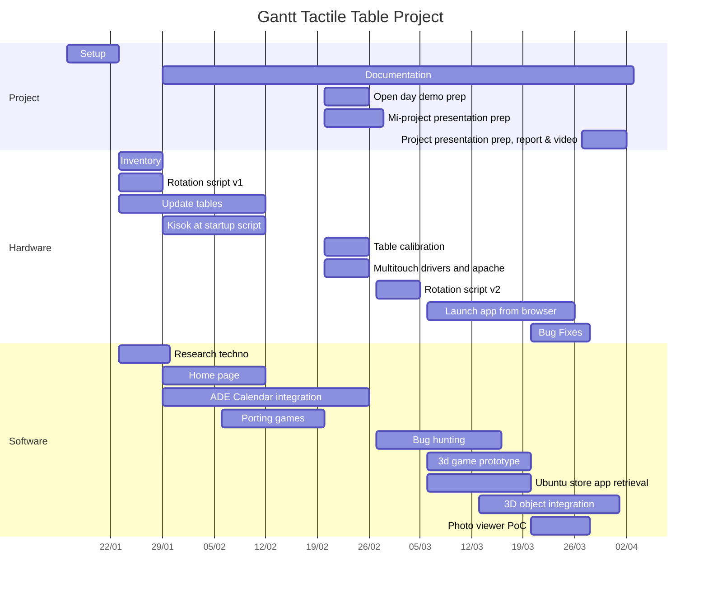

# Projet table tactile : Journal de bord

## 16/01/2023
* Organisation du groupe
* Rédaction du cahier des charges
* Récupération du projet SeriousGame
* Récupération des équipements (3 tables )
    * démonter et réparer les connectiques, les tables en général.
    * constatation de la dégradation d'une partie d'une dernière table.
* Création d'un trello pour le projet
* Création Journal de bord

## 23/01/2023

Noah BOMPARD : 
- Mails a la responsable, du fablab, relance du fablab
- mail au contact informatique du crous 
- Inventaire des fichiers présents sur les tables tactiles 
- test tacticité de la table tactile avec vincent 
- début de la réinstallation linux, avec prise en charge tactile : https://codimd.math.cnrs.fr/YgER1zQEQiGpUR5LmfjqrA?both
- démontage et analyse du prblème de pile CMOS, mail de commande de la pile.
- j'ai commencé a apprendre a utiliser node.js en vue de l'application client/restaurant
- démontage des boitiers de commande pour les mettre a jour et les réparer a la maison (batterie CMOS à changer)
- tests avec ubuntu touch

Fikret KÜRKLÜ: 

- Recherche de données pour l'intégration d'informations liés à ADE, pour cela on va faire une exportation des données sous format ics pour ensuite les traités en javascript. Recherche de librairies pour traiter les données, je vais réaliser quelques essais avec ical.js, une librairie de chez Mozilla.Je vais lire la documentation. 
- Pour intégrer les menu du jours au sein du site web, deux choix s'offre à nous, faire du scrapping de la page des restaurants de chaque resto crous et réaliser un affichage sur notre appli, ce qui permettra facilement aux utilisateurs d'accéder au menu, ou bien contacter des membres du crous pour voir comment on pourrait accéder aux données plus facilement. Je pense réaliser un petit script python sous format de serveur web, qui réalisera de la récolte de données depuis lien fournis.
- J'ai également commencer à regarder quelques tutoriels three.js pour essayer une implémentation dans  la présentation de polytech que nous souhaitons réaliser.

Vincent Ducros:

- Création d'une extension gnome utilisant du javascript pour lancer un script bash avec une commande xrandr pour faire une rotation de l'écran.
- Vérification des capacités multipoints des tables : visiblement absentes. J'ai cherché sur Internet mais pas trouvé beaucoup d'informations même si visiblement c'était pas très bien supporté sur les versions un peu plus anciennes d'ubuntu installé actuellement.
- Aide à démonter et vérifier l'état des installs avec Noah

Benjamin Bracquier:
- vérification de l'existence du serveur local(il n'y en a pas)
- recherche d'information sur le changement en mode kiosk et si il faut changer de naviguateur internet
- -recherche d'information de la construction et structure de notre page d'acceuil

## 29/01/2023

Benjamin Bracquier:
- continue l'implémentation de la page d'acceuil avec ajout du carouselle
- déjà implémenter dans la page d'acceuil:météo,horloge(date),flux rss (le monde),lien vers le site de polytech
- recherche de jeu à porter pour qu'on y accède à partir de la page d'acceuil

Fikret KÜRKLÜ:
- Mise en place du projet web en générant un projet sous next js accompagné de tailwind
- Mise en place d'un calendrier ade avec FullCalendar
- Cherche une solution de convertir les documents json récupérer depuis le fichier ics d'ade sous un format spécifique.

Vincent DUCROS:
- Vérification de l'état de la table basse : l'écran n'est pas calibré
- Recherche sur comment calibrer des écrans tactiles
- Début de l'écriture de la documentation sur la création d'une extension GNOME Shell

Noah BOMPARD : 
- Recherches sur la mise en place d'un syst tactile ( ubuntu touch, touché, touchgg)
- réparation et mise en marche de la table basse
- début de l'écriture d'un script de démarrage pour mettre le mode kiosk au startup
- mise a jour des 5 machines vers ubuntu 22.04 ( inventaire, maj, compatibilité, etc...)

## 06/02/2023

Vincent Ducros:
- Fin de la documentation sur les extensions GNOME Shell
- Recherche sur la possibilité de lancer des applications installés localement sur un pc depuis un navigateur (pour lancer des jeux installés localement malgré le mode kiosque)

Noah BOMPARD : 
- Documentation sur la mise a jour ubuntu, le mode tactile, touché
- mise en place du script pour lancer le mode kiosk au startup avec gnome startup application
- fin des mise a niveau des ordis, ubuntu, multitouch, tactiles, et clic droit si appui long.

Benjamin Bracquier :
- importation de jeu pour mettre sur la page d'acceuil
- ajout de boutton pour revenir à la page d'acceuil à partir de la page de jeu

## 20/02/2023

Vincent Ducros:
- Setup complet d'une table pour la démonstration de la JPO
    + Mise en place du serveur local apache avec Benjamin
    + Importation et test du script de rotation sur la table : problème = on a bien la rotation de l'écran mais pas du digitizer
    + Remontage de la table et vérification de son bon fonctionnement
- Calibration de l'écran via xinput_calibrator

Fikret Kürklü:
- Récupération des données depuis ADE et conversion en json grâce à l'outil ical2json récupérer depuis NPM
- Début de la page EDT pour l'affichage des données récolté depuis ADE 

Benjamin Bracquier
- test des jeux pour voir si ils marchent sur table tactile et les retirer sinon
- Mise en place de la page d'acceuil et du serveur apache avec Vincent

Noah BOMPARD:
- Mise en place de xinputcallibrator
- Installation lightdm
- Installation driver linux egalax
- Tests sur la tacticité de l'écran+ multitouch

## 27/02/2023

Fikret KÜRKLÜ:
- Finalisation de la page ADE, et affichage des emplois du temps de trois formations : INFO, IESE, TIS

Benjamin Bracquier :
- ajout de pare-feu sur la table pour voir si cela résout l'erreur du flux rss et de la météo
- changement de code pour la météo pour qu'elle marche sans erreur de requête
- recherche d'alternative pour le flux rss

Noah BOMPARD :
- Rédaction totale de la documentation associée aux installations, réparation apache sur machine + jpo

Vincent Ducros:
- Recherche et mise à jour du script pour prendre en charge également la rotation du digitizer pour pouvoir interagir avec la table lorsque son orientation à été modifiée
- Présentation du projet à la JPO
- Création de la présentation du 28/02

## 06/03/2023

Vincent Ducros:
- Test sur l'ouverture d'application locale depuis le navigateur sur ma machine (ouverture des jeux inclus sous Ubuntu)
- Première version de la documentation sur le thème précédemment cité.

Benjamin Bracquier :
- Recherche de jeux pour rajouter sur la page d'acceuil 

Noah BOMPARD :
- développement mini prototype 3d éxecutable a lancer sur le site web 
- recherche et documentation sur les méthodes d'intégrations d'objets 3d en web en fonciton de leur format.

# 13/03/2023 
Noah BOMPARD :
 - exportation de l'exécutable => marche sur windows mais pas en version linux (pb de méméoire vulcan)
 - recherche développement phaser pour des jeux webs, tree.js pour l'intégration d'un objet 3D
 - recherche de doc sur les différentes solutions d'intégration 3d disponibles.

Vincent DUCROS :
- aide a déboguage vulkan + exportation windows-> linux

Benjamin Bracquier :
- Recherche de jeux depuis ubuntu software 
- recherche pour mettre des executables sur le page web

# 20/03/2023
Noah BOMPARD :
- tentative de réparation (encore) du multitouch (fonctionne uniquement via l'app de test du driver)
- déboguage de la tablette 
- tests d'applications importables sur site via l'app store linux ( dessin, sudoku, majhong, visionneuse photo, etc..)
- déboguage vulkan (et suremenent recherche d'une autre solution)
- début de tests sur phaser en vue de la visionneuse photo

Benjamin Bracquier :
- importation de jeux et d'application de ubuntu sur le site
- lien de la page d'acceuil vers le site du calendrier
- tests d'applications

Vincent Ducros :
- Création avec Benjamin des liens vers les applications locales et du store sur le site et la table
- Problème : on ne peut pas modifier les fichiers .desktop des applications snap installés depuis le store d'ubuntu pour créer une URL custom => recherche d'une solution
- Aide au déboguage Vulkan

# 21/03/2023
Noah BOMPARD :
- tentative de réparation (encore) du multitouch (fonctionne uniquement via l'app de test du driver)
- déboguage de la tablette 
- dézoom de 500% => apparition de la météo + les news
- abandon vulkan
- phaser en vue de la visionneuse photo

Benjamin Bracquier :
- tests des applications 
- test du mode kiosk avec les applications locales

Vincent Ducros :
- Solution : On peut override les fichiers .desktop en leur donnant un autre nom et en les stockant dans le dossier ./local/share/applications
- Recherche d'une solution au problème qui nous empêche de faire défiler une page sur Firefox sans utiliser la barre

# 27/03/2023

Noah BOMPARD :
- Réussi a réparer le tactile sur firefox (youpi on slide)
- prototype de la visionneuse d'image photo réussi
- film de la tablette + montage vidéo

Benjamin Bracquier :
- importation de la visionneuse d'image photo dans la home page

Vincent Ducros :
- Modification du fichier de configuration de Firefox sur la table pour régler le problème de slide
- Recherche d'une solution pour ne pas avoir besoin d'un clavier physique lors du démarrage
- Dans cette optique, tests de différents greeter (écran de login) pour notre gestionnaire d'affichage afin d'en trouver un qui supporte le clavier visuel par défaut.
- Pas de succès, donc après délibération, remise en place du mécanisme d'autologin

# 28/03/2023 
Noah BOMPARD :
- derniers tests avec vincent 
- phaser ajout du bouton reset
- montage de la vidéo

Benjamin Bracquier :
- commencement du rapport final

Vincent Ducros :
- Mise en place des derniers liens custom pour les applications présentes sur la table et configuration pour lancer un container docker au démarrage pour la partie de Fikret
- Tests avec Noah et tournage pour la vidéo de présentation
- Diagramme de Gantt
- Documentation configuration réparation slide sur Firefox et mise à jour de celle sur les URL custom

